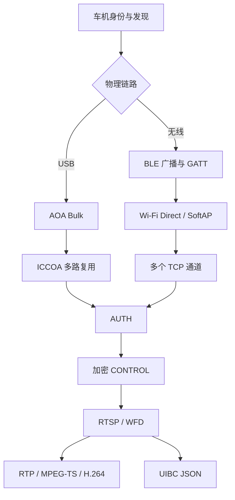
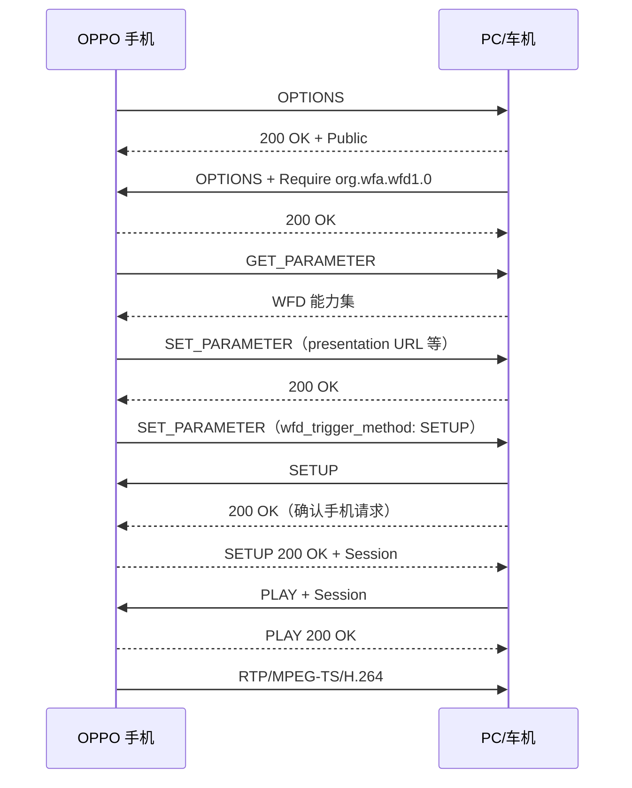

# OpenCarLink PC 从 0 到 1 开发手册

> 面向目标：在 Windows 或自研 Android 车机上模拟 ICCOA/CarLink 车机端，使 OPPO/ColorOS 手机进入智慧车载桌面，并实现视频显示、鼠标/触控反向控制。  
> 实机基线：OPPO PKT110、ColorOS 16.1（Android 16）、Windows 11、Qualcomm QCA9377。  
> 文档版本：2026-08-05。  
> 验证边界：USB 方案已经端到端验证；无线 BLE 引导已经验证；无线 Wi-Fi/P2P 组网仍在定位，不应被描述为已完成。

## 1. 先理解要开发的到底是什么

这个项目不是普通的 Android 屏幕镜像，也不是在手机和车机上各装一个自定义 APK 后传输屏幕。

手机中的 OPPO 车载服务已经包含投屏端。电脑或车机要扮演的是 ICCOA/CarLink 的“车机端”，让手机相信它连接的是一个兼容车机。完整会话至少包含：

- 车机身份发现。
- 物理链路建立：USB AOA，或 BLE 引导后的 Wi-Fi/P2P。
- ICCOA 通道创建。
- 密钥协商和认证。
- 加密 CONTROL 配置和心跳。
- RTSP/Wi-Fi Display 协商。
- RTP/MPEG-TS/H.264 视频接收和解码。
- UIBC 触控与车机按键回传。

只做屏幕抓取或只把手机切到 AOA 模式，都不能让 ColorOS 完成车载连接。

### 1.1 两条链路的共同核心



AUTH、CONTROL、RTSP、视频和 UIBC 的上层逻辑可以复用。USB 与无线的主要区别是传输层：

- USB：一对 AOA Bulk 端点之上再做通道复用。
- 无线：各功能直接使用独立 TCP 端口；BLE 只负责发现和下发 Wi-Fi 参数。

### 1.2 当前各阶段的可信度

| 模块 | 状态 | 证据 |
|---|---:|---|
| AOA 切换与 WinUSB Bulk | 已验证 | OPPO 从 `22D9:2765` 重枚举为 `18D1:2D01`，IN/OUT Bulk 成功 |
| USB 多路复用 | 已验证 | CONTROL、RTSP、RTP、UIBC、AUTH 等通道均工作 |
| AUTH/CONTROL | 已验证 | 手机认证成功、配置被接受、心跳稳定 |
| RTSP/RTP/视频 | 已验证 | 手机智慧车载桌面可持续显示 |
| UIBC | 已验证 | 鼠标点击、拖动、返回和主界面键可用 |
| Windows EXE | 已验证 | USB 成品可直接运行 |
| ICCOA BLE 广播 | 已验证 | ColorOS 命中 `PC CarLink` |
| 原始 ATT/GATT | 已验证 | 手机写入 Client Info，接收 Server Info |
| Windows ICCOA P2P 组网 | 未完成 | 手机进入 ASSOCIATING，但 10 秒后 group formation 超时 |
| 无线 AUTH 及投屏 | 未到达 | 手机尚未通过 P2P 获得 IP，也未连接 TCP 57209 |

## 2. 工程环境与工具

### 2.1 推荐环境

- Windows 11 x64。
- Python 3.12 x64。
- OPPO/OnePlus 真机，开启开发者选项和 USB 调试。
- 支持数据传输的 USB 线。
- USB 有线调试需要 libusb/WinUSB。
- 无线 BLE 原始 HCI 调试需要一只可由 WinUSB 接管的 BLE 控制器。
- 无线 P2P 最好准备独立 USB Wi-Fi 网卡；普通“支持热点”不等于支持可控的 Wi-Fi Direct GO。

本项目实测硬件：

```text
手机：OPPO PKT110
手机普通 USB：22D9:2765
AOA：18D1:2D01
电脑 Wi-Fi：Qualcomm QCA9377 802.11ac
电脑蓝牙 USB：0CF3:E009
```

### 2.2 Python 依赖

核心依赖：

```text
pyusb
libusb-package
cryptography
av
pillow
psutil
winrt-runtime
winrt-Windows.Devices.Bluetooth
winrt-Windows.Devices.Bluetooth.GenericAttributeProfile
winrt-Windows.Devices.WiFiDirect
winrt-Windows.Networking.NetworkOperators
其余对应的 WinRT Foundation/Networking/Streams 包
```

从空目录创建环境：

```powershell
py -3.12 -m venv .venv
.\.venv\Scripts\python.exe -m pip install --upgrade pip
.\.venv\Scripts\python.exe -m pip install pyusb libusb-package "cryptography>=45,<47" "av>=18,<19" "pillow>=12,<13" "psutil>=7,<8"
.\.venv\Scripts\python.exe -m pip install winrt-runtime==3.2.1 winrt-Windows.Devices.Bluetooth==3.2.1 winrt-Windows.Devices.Bluetooth.GenericAttributeProfile==3.2.1 winrt-Windows.Devices.Enumeration==3.2.1 winrt-Windows.Devices.Radios==3.2.1 winrt-Windows.Devices.WiFiDirect==3.2.1 winrt-Windows.Foundation==3.2.1 winrt-Windows.Foundation.Collections==3.2.1 winrt-Windows.Networking==3.2.1 winrt-Windows.Networking.Connectivity==3.2.1 winrt-Windows.Networking.NetworkOperators==3.2.1 winrt-Windows.Security.Credentials==3.2.1 winrt-Windows.Storage.Streams==3.2.1
.\.venv\Scripts\python.exe -m pip install ruff pyinstaller==6.15.0
```

### 2.3 调试工具

- ADB/platform-tools：获取 logcat、`dumpsys wifi`、`dumpsys wifip2p`。
- Zadig/libwdi：只给指定 USB 接口绑定 WinUSB。
- JADX：检查可合法用于互操作分析的 Android APK Java 层逻辑。
- Ghidra：检查必要的原生库调用和数据边界。
- Wireshark/ETW：定位 USB、TCP、WLAN/WDI 问题。
- PyInstaller：打包单文件 EXE。

不要把反编译结果直接当作真相。官方演示车机 APK、手机端服务和不同 ColorOS 版本可能处于不同协议角色；每个结论都应由实机日志或抓包再次验证。

## 3. 推荐项目结构

```text
open_carlink_pc/
├─ src/open_carlink_pc/
│  ├─ aoa.py                 # USB 枚举、AOA 切换、Bulk 传输
│  ├─ mux.py                 # USB 多路复用和建通道消息
│  ├─ config.py              # 稳定车机身份和本地数据目录
│  ├─ auth.py                # P-256、HMAC、HKDF、AES-GCM
│  ├─ ucar_protocol.py       # UCar 20 字节头、CRC、CONTROL
│  ├─ rtsp.py                # WFD/RTSP 状态机
│  ├─ video.py               # RTP、MPEG-TS、H.264 解码
│  ├─ uibc.py                # 触控和按键 JSON
│  ├─ controller.py          # USB 总状态机
│  ├─ raw_ble.py             # 原始 HCI、L2CAP、ATT/GATT
│  ├─ wireless.py            # BLE 数据、热点/WFD 后端
│  ├─ wireless_controller.py # 无线总状态机和 TCP 通道
│  ├─ capture.py             # 隐私可控的诊断记录
│  └─ ui.py                  # Windows 界面、画面和坐标映射
├─ tests/
├─ tools/
│  ├─ wireless_diagnostic.py
│  ├─ query_wlan_channel.py
│  └─ wfd_probe.py
├─ docs/
├─ requirements.txt
├─ build.ps1
└─ OpenCarLinkPC.spec
```

模块边界非常重要。不要把 USB read、AUTH、RTSP、解码和 Tkinter 绘制全部塞在一个线程中，否则后续无法判断卡顿来自哪一层。

## 4. 第一件事：生成并持久化稳定车机身份

车机身份至少包含：

```text
car_id           12 个十六进制字符，即 6 字节
model_id         8 个字符
short_name       最多 16 个 UTF-8 字节
protocol_version 例如 1.2
vendor_data      最多 4 个十六进制字符，即 2 字节
```

本项目使用：

```text
model_id = 00000000
short_name = PC CarLink
protocol_version = 1.2
vendor_data = 0000
```

身份必须持久化，不能每次启动都随机生成新 `car_id`。同时持久化：

- 车机长期 P-256 认证私钥。
- 已配对手机 ID 与手机长期认证公钥。
- 后续可能需要的无线配对状态。

Windows 建议保存到：

```text
%LOCALAPPDATA%\OpenCarLinkPC\identity.json
%LOCALAPPDATA%\OpenCarLinkPC\auth\
```

USB AOA 使用的 PIN 为 `car_id` 六字节的 Base64。例如 `01 02 03 04 05 06` 会生成一个 8 字符 Base64 值。无线官方车机实现则周期性生成六位数字 PIN，两者不要混用。

## 5. USB 路线：从枚举到投屏

USB 是最适合从零开发的路径，因为它已在本项目中完整验证。建议先把 USB 做到稳定，再开始无线。

### 5.1 枚举普通手机

通过 PyUSB/libusb 枚举 USB 设备，优先识别已知手机厂商 VID：

```text
22D9  OPPO
2A70  OnePlus
2717  Xiaomi
2D95  vivo
18D1  Google/AOA
```

实机普通模式是 `22D9:2765`。手机应解锁，并把 USB 用途设为“文件传输”或类似数据模式。

失败日志：

```text
Access denied (insufficient permissions)
```

不一定是 ADB 本身。O+ Connect、手机助手、Windows 手机连接、同步软件和厂商后台服务都可能持有接口。关闭 `adb.exe` 只是排查的一步。

### 5.2 请求切换到 Android Open Accessory

依次发送 AOA vendor control request：

```text
AOA_GET_PROTOCOL   = 51
AOA_SEND_IDENTITY  = 52
AOA_START_ACCESSORY = 53
```

| 操作 | bmRequestType | bRequest | 方向/数据 |
|---|---:|---:|---|
| 查询 AOA 版本 | `0xC0` | `51` | 读取 2 字节小端版本 |
| 发送身份字符串 | `0x40` | `52` | `wIndex=0..5` |
| 启动 AOA | `0x40` | `53` | 无正文 |

本实现发送的身份字符串：

| index | 内容 |
|---:|---|
| 0 | `ICCOA` |
| 1 | `CarLink` |
| 2 | `ICCOA CarLink` |
| 3 | `1.0.0` |
| 4 | `http://www.iccoa.cn/` |
| 5 | ICCOA 扩展 serial |

扩展 serial 格式：

```text
car_id;model_id;short_name;usb_pin;protocol_version;vendor_data
```

示例结构：

```text
010203040506;00000000;PC CarLink;<Base64 PIN>;1.2;0000
```

当前实机验证版本直接发送 UTF-8 字节。若适配其他手机遇到身份字段解析问题，可以单独验证字符串末尾 NUL，但不要在已工作的 OPPO 路径中无依据修改。

发送 `AOA_START_ACCESSORY` 后，旧 USB 设备会消失并重新枚举。必须释放旧 device handle，再轮询新的 AOA VID/PID。

实机成功标志：

```text
手机支持 AOA 2.0
已请求手机切换到 ICCOA CarLink 配件模式
手机已重新枚举为 AOA 18D1:2D01
```

### 5.3 Windows 驱动：只接管 AOA 数据接口

AOA 切换成功不代表程序能访问 Bulk endpoint。Windows 可能继续使用不支持 PyUSB 的驱动，从而出现：

```text
NotImplementedError: Operation not supported or unimplemented on this platform
```

AOA 复合设备要区分：

- `MI_00`：AOA 数据接口，应绑定 WinUSB。
- `MI_01`：ADB 接口，应保留 Android/厂商 ADB 驱动。

最重要的规则：

> 只替换 `USB\VID_18D1&PID_2D01&MI_00`。不要替换 `MI_01`，也不要替换手机正常模式下的整个 OPPO/MTP 设备。

否则会导致 ADB、MTP 或厂商连接一起失效。

### 5.4 打开正确的 Bulk 端点

遍历活动 configuration 中满足以下条件的接口：

```text
bInterfaceClass    = 0xFF
bInterfaceSubClass = 0xFF
bInterfaceProtocol = 0x00
```

然后寻找成对的 Bulk IN/OUT endpoint。实机出现过：

```text
IN=0x81
OUT=0x01
```

不能把这两个地址永远写死，仍应从 descriptor 枚举。读取和写入都要支持分块和 Windows/libusb timeout；本实现使用 16 KiB 分块。

### 5.5 USB 多路复用帧

AOA Bulk 不是每个业务一个 endpoint，业务在同一字节流中复用。

帧格式：

```text
offset  size  encoding     meaning
0       4     big-endian   channel_id
4       4     big-endian   payload_length
8       N                  payload
```

当 `payload_length < 8` 时，传输层仍补齐到 8 字节；上层只能取声明长度，不能把补零交给协议解析器。

安全限制建议：

- channel 范围限制在合理值，例如 1 到 240。
- 单帧长度设置上限，例如 64 MiB。
- `read_exact()` 必须循环，不能假设一次 USB read 返回完整数据。
- 所有写操作加同一把锁，避免心跳、RTSP 回复和触控数据交叉写入。

### 5.6 channel 1 的建通道消息

channel 1 的 payload 固定为 10 字节：

```text
>iiBB
port         4 字节有符号大端整数
channel_id   4 字节有符号大端整数
socket_type  1 字节
message_type 1 字节
```

手机初始请求中的 `channel_id` 经常为 `-1`。车机分配实际 channel，并把 `socket_type` 从 1 回复为 2。

已验证端口/通道：

| channel | port | 名称 | 主要用途 |
|---:|---:|---|---|
| 1 | — | MUX CONTROL | 创建/确认逻辑 socket |
| 2 | 57219 | CONTROL | UCar 配置和心跳 |
| 3 | 7236 | RTSP | WFD 信令 |
| 4 | 15550 | RTP | 视频流 |
| 5 | 4321 | UIBC | 触控和按键 |
| 6 | 57229 | MEDIA | 媒体扩展 |
| 7 | 57209 | AUTH | 认证和密钥协商 |
| 8 | 57239 | SENSOR | 传感器 |
| 9 | 57249 | CERT | 证书扩展 |

实机启动时曾看到：

```text
手机请求 RTSP channel=-1 socketType=1 msgType=2
手机请求 UIBC channel=-1 socketType=1 msgType=2
手机请求 CONTROL channel=-1 socketType=1 msgType=1
手机请求 MEDIA channel=-1 socketType=1 msgType=1
手机请求 SENSOR channel=-1 socketType=1 msgType=1
```

当 RTSP 和 UIBC 已出现后，车机主动请求 AUTH 和 RTP：

```text
AUTH port=57209 channel=-1 socketType=1 msgType=2
RTP  port=15550 channel=-1 socketType=1 msgType=2
```

只回复这些通道请求仍然不够。最初版本已经收到了 RTSP 和 CONTROL 数据，手机仍然提示连接失败，因为 AUTH、加密 CONTROL 和心跳尚未实现。

## 6. UCar 20 字节消息头

AUTH 和 CONTROL 都使用 UCar 消息。TCP/USB payload 都是字节流，一次 read 可能包含半条、一条或多条 UCar 消息，所以必须先按头部长度重组。

头格式：

| offset | size | 格式 | 内容 |
|---:|---:|---|---|
| 0 | 4 | 大端 `uint32` | 总长度，包含 20 字节头 |
| 4 | 4 | 大端 `uint32` | sequence ID |
| 8 | 4 | 大端 `uint32` | 秒级 Unix timestamp |
| 12 | 1 | bit field | source、data format、message type |
| 13 | 1 | `uint8` | category |
| 14 | 2 | 大端 `uint16` | method |
| 16 | 2 | 大端 `uint16` | reserved |
| 18 | 2 | 大端 `uint16` | CRC16-MODBUS |

flags：

```text
bit 0      source
bit 1..2   data format
bit 3..4   message type
```

当前车机发送使用：

```text
source       = 0
FORMAT_PB3   = 1
MESSAGE_SEND = 0
MESSAGE_REQ  = 1
MESSAGE_RES  = 2
```

CRC 对头部前 18 字节计算。修改加密后 body 长度时，必须同时更新 offset 0 的总长度和 offset 18 的 CRC。

流式解析器应：

1. 累积数据直到至少 20 字节。
2. 读取总长度。
3. 验证长度在 `[20, 8 MiB]` 等合理范围内。
4. 数据足够后取出一条完整消息。
5. 校验 CRC。
6. 继续解析缓冲中剩余消息。

## 7. AUTH：让手机真正承认这台车机

### 7.1 方法号

```text
category = 3
method 1 = AUTH_REQUEST
method 2 = AUTH_RESPONSE
method 3 = AUTH_CONFIRM
```

正文采用 protobuf wire format。本项目为了避免依赖未知 `.proto`，只实现 varint、fixed32、fixed64 和 length-delimited 的最小通用解析器。

### 7.2 手机认证请求字段

| protobuf field | 含义 |
|---:|---|
| 1 | protocol version |
| 2 | 手机长期认证公钥，P-256 裸 `X || Y`，64 字节 |
| 3 | 认证公钥 HMAC |
| 4 | 手机本次 ECDH 协商公钥，64 字节 |
| 5 | 协商公钥签名 |
| 6 | 手机 nonce，32 字节 |
| 7 | phone/device ID |
| 8 | 手机型号 UTF-8 |
| 9 | user confirmed 标志 |

### 7.3 首次认证算法

1. 读取车机 PIN 的 UTF-8 字节。
2. 验证手机认证公钥 HMAC：

```text
hmac_key = SHA256(client_nonce || pin)
expected = HMAC-SHA256(hmac_key, phone_auth_public_raw)
```

3. 用手机长期认证公钥验证：

```text
ECDSA-SHA256(phone_agreement_public_raw || client_nonce)
```

4. 加载或生成车机长期 P-256 认证私钥。
5. 每次连接生成新的 P-256 ECDH 协商私钥和 32 字节车机 nonce。
6. 计算 ECDH shared secret。
7. 派生 16 字节会话密钥：

```text
salt = SHA256(client_nonce || server_nonce)
HKDF-SHA256(
  input_key_material = ecdh_shared_secret,
  salt = salt,
  info = "session_key",
  length = 16
)
```

8. 车机响应中的认证公钥 HMAC：

```text
hmac_key = SHA256(server_nonce || client_nonce || pin)
HMAC-SHA256(hmac_key, car_auth_public_raw || phone_auth_public_raw)
```

9. 车机长期认证私钥签名：

```text
car_agreement_public_raw ||
phone_agreement_public_raw ||
server_nonce ||
client_nonce
```

10. 保存手机 ID 与手机长期认证公钥，供快速认证使用。

### 7.4 快速认证

快速认证请求不再携带完整长期认证公钥/HMAC。车机通过 phone ID 查找以前保存的公钥：

- 找到：继续验证签名并派生新的 session key。
- 找不到：返回要求转为首次认证的结果，不能拿空公钥继续。

车机身份私钥和 peers 文件如果丢失，手机可能仍认为它连接的是旧车机，而电脑认为它是新手机，最终造成认证失败。调试时要明确是在测试“首次认证”还是“快速认证”。

### 7.5 AES-GCM 封装

CONTROL 消息只加密 20 字节头之后的 body，头保持明文但要更新总长度和 CRC。

每段加密负载：

```text
4 字节大端 IV 长度
IV，当前使用随机 12 字节
4 字节大端密文长度
AES-GCM ciphertext + 16 字节 tag
```

解密器应支持 payload 中连续出现多段上述结构，而不是只解析一段。

### 7.6 AUTH_CONFIRM

手机在 protobuf field 1 中携带 AES-GCM 密文。解密后得到 connection info 字符串，并将会话标记为 confirmed。无线模式下这个字符串可能包含手机 IP/端口信息；USB 模式也应保存它供日志和诊断使用。

## 8. CONTROL 配置与心跳

### 8.1 方法号

```text
category = 1
method 1  = HEARTBEAT
method 24 = GET_UCAR_CONFIG_REQUEST
method 25 = GET_UCAR_CONFIG_RESPONSE
```

如果 CONTROL 请求先于 AUTH 完成到达，应暂存完整 UCar 消息，认证成功后再解密处理。直接丢弃会让手机等待配置超时。

### 8.2 已验证的车机配置

当前稳定基线：

```text
width  = 1280
height = 720
dpi    = 320
fps    = 30
```

响应 protobuf 字段：

| field | 当前值/含义 |
|---:|---|
| 1 | 6 字节 car ID |
| 2 | width |
| 3 | height |
| 4 | dpi |
| 5 | width |
| 6 | height |
| 7 | fps |
| 8 | `1` |
| 11 | `149` |
| 12 | `1` |
| 13 | `1` |
| 16 | 2 字节 vendor data |
| 17 | SDK 标识 `v1.2.12-202301290958-5a25c0f` |

不要在不知道字段语义时随便删掉“不理解”的字段。它们来自已验证的实机兼容配置。

### 8.3 心跳

配置回复被手机接受后，每 2 秒发送一次加密心跳：

```text
category = 1
method = 1
message type = SEND
protobuf field 1 = 毫秒级 Unix timestamp
```

sequence ID 持续递增。最初版本没有心跳，手机会短暂建立后又判定连接失败。

## 9. RTSP/Wi-Fi Display 状态机

### 9.1 RTSP 必须流式解析

不能把一次 USB/TCP read 当成一条 RTSP 消息。正确做法：

1. 在缓冲中寻找 `\r\n\r\n`。
2. 解析 header。
3. 读取 `Content-Length`。
4. 等待完整 body。
5. 处理一条后继续解析缓冲中的下一条。

实机出现过多条 RTSP 合并在一个 payload，也出现过一条消息跨多个 payload。

### 9.2 已验证交互顺序



### 9.3 ColorOS 需要的关键能力

```text
wfd_car_display_mode: mode=0;display=1280:720;dpi=320;fps=30
wfd_video_formats: 28 00 01 01 FFFFFFFF FFFFFFFF FFFFFFFF 00 0000 0000 00 none none
wfd_audio_codecs: AAC 0000000F 00
wfd_client_rtp_ports: RTP/AVP/TCP;unicast 19000 0 mode=play
wfd_uibc_capability: input_category_list=GENERIC;generic_cap_list=Keyboard, Mouse, SingleTouch;hidc_cap_list=none;port=none;uibc_encrypted=false
ovm_control_capability: supported
wfd_standby_resume_capability: supported
```

最关键的厂商扩展是 `wfd_car_display_mode`。没有它时，标准 WFD 对话看似正常，手机仍可能不启动正确的车载桌面编码器。

当前已验证 USB 实现在 SETUP 中使用：

```text
Transport: RTP/AVP/TCP;unicast;client_port=15550
```

能力响应里出现的 `19000` 与实际 SETUP/ICCOA RTP 通道的 `15550` 是当前实机兼容行为。重构时不要仅凭“端口看起来应该一致”擅自统一；无线完成后需要再次验证这组端口语义。

## 10. RTP、MPEG-TS 和 H.264

最初看到流中有 H.264 NAL 特征，就误以为 RTP payload 是裸 H.264，结果无法稳定解码。实机真实结构：

```text
2 字节大端 RTP packet length
RTP v2 packet
RTP payload type = 33
RTP payload = 一个或多个 188 字节 MPEG-TS packet
MPEG-TS 内部承载 H.264
```

解析顺序：

1. 用 2 字节长度从连续字节流中重组完整 RTP 包。
2. 验证 RTP version 为 2。
3. 根据 CSRC count 跳过 CSRC。
4. 若 X 位存在，解析扩展头长度。
5. 若 P 位存在，移除 padding。
6. 只接收 PT=33。
7. 验证 payload 长度是 188 的整数倍，首字节为 `0x47`。
8. 把连续 TS 数据喂给 FFmpeg/PyAV 的 `mpegts` demuxer。
9. 找到 video stream，解码为图像帧。

PyAV 实测配置：

```text
format = mpegts
probesize = 32768
analyzeduration = 500000
thread_type = SLICE
thread_count = 2
codec flags2 = +fast
```

过度使用 `nobuffer`、极小探测窗口会导致 FFmpeg 来不及识别流，表现为收到了大量 RTP 却始终没有视频轨。

## 11. UIBC 反向控制

### 11.1 触控 JSON

ColorOS 16.1 当前接收路径要求明文 UTF-8 JSON：

```json
{"type":1,"action":0,"width":1280,"height":720,"count":1,"trackID0":0,"x0":640,"y0":360}
```

action：

```text
0 = DOWN
1 = UP
2 = MOVE
```

按键：

```json
{"type":2,"action":2,"keycode":4,"metaState":0}
```

已用键值：

```text
4    = 返回
8103 = 车载主界面
```

### 11.2 最大的 UIBC 坑：错误启用加密

官方车机 SDK 中存在 `uibc_session_key` 和 AES-GCM 支持，一度让实现认为 UIBC 必须加密。实机日志却显示手机收到密文后直接把它转为字符串，并交给 `JSONObject` 解析，随后报乱码/JSON 转换失败。

最终做法：

```text
RTSP 宣告 uibc_encrypted=false
UIBC 通道发送明文 JSON
```

只有双方明确协商加密时，才使用 AUTH session key 包装 UIBC。协议中“支持某能力”不等于本次方向已经启用该能力。

### 11.3 画面缩放与坐标映射

界面需要两种模式：

- 完整显示：`scale=min(canvas/source)`，四周留黑边。
- 铺满显示：`scale=max(canvas/source)`，居中裁切。

触控必须使用同一几何变换逆映射：

```text
source_x = (mouse_x + crop_x) / scale
source_y = (mouse_y + crop_y) / scale
```

完整显示时 `crop_x/crop_y` 可以用负的绘制偏移统一表达。最后再把实际视频 frame 尺寸映射到协商的 1280×720 UIBC 坐标。

MOVE 建议限频到约 30 次/秒，避免鼠标事件占满 USB/TCP 和 UI 线程。

## 12. UI、性能和低延迟

推荐线程模型：

```text
USB/TCP 接收线程
  ├─ 协议解析
  ├─ TS 数据写入解码输入缓冲
  └─ 轻量事件日志

视频解码线程
  └─ FFmpeg/PyAV -> 最新图像帧

UI 主线程
  ├─ 每约 15 ms 获取最新帧
  ├─ 绘制/缩放
  └─ 鼠标事件 -> UIBC
```

画面队列容量设为 1。新帧到来时丢弃尚未显示的旧帧，实时投屏应追求“接近直播边缘”，不是把每帧都排队播完。

曾造成明显卡顿的错误：每收到一个 RTP payload 都执行 SHA-256、打开 JSONL、写入并关闭文件。RTP 每秒可能数百包，这会直接阻塞解码输入。

当前做法：

- 默认 RTP 只记录首包和每 300 包一次摘要。
- 只有用户显式开启“完整负载”才记录每包 payload。
- UI 默认隐藏日志区域，让视频占据主要空间。
- 禁止同时运行多个客户端实例。

完整负载可能包含导航、媒体、联系人或通话相关数据，必须提醒用户并控制保存范围。

## 13. 分辨率、帧率和画质

当前源码固定基线是 1280×720、30 FPS。分辨率、DPI 和 FPS 同时出现在：

- UCar config response。
- `wfd_car_display_mode`。
- UIBC 坐标基准。
- UI 触控映射。

修改时必须统一更新，不能只改窗口缩放。

建议逐级测试：

1. 1280×720 @ 30：稳定基线。
2. 1920×1080 @ 30：优先提升文字清晰度。
3. 1280×720 @ 60：优先提升滑动流畅度。
4. 1920×1080 @ 60：最后测试带宽和解码余量。

码率可能由手机编码器自行决定。提高 UI 显示尺寸不会增加源视频细节。每次修改协商参数后，完整断开并重建 AOA/RTSP 会话。

## 14. USB 总状态机的实现顺序

推荐控制器按以下顺序推进，并给每个阶段设置清晰状态：

1. 枚举普通手机。
2. 若不是 AOA，发送 AOA identity 并等待重枚举。
3. 打开 `MI_00` Bulk IN/OUT。
4. 启动 MUX read loop。
5. 响应手机建通道请求，并主动请求 AUTH/RTP。
6. AUTH 尚未完成时缓存 CONTROL。
7. AUTH_CONFIRM 后解密和回复 CONTROL。
8. 开始 2 秒心跳。
9. 完成 RTSP OPTIONS/GET/SET/SETUP/PLAY。
10. 解析 RTP/MPEG-TS 并启动视频解码。
11. 状态显示“投屏中”后才开放 UIBC。
12. 断开时停止心跳、关闭解码流、释放 WinUSB 接口。

每层都有自己的流式 reassembler，不能共享一个“按 read 分包”的假设。

## 15. 无线路线：BLE 发现和 GATT 引导

### 15.1 无线启动顺序

参考车机侧实现的正确顺序是：

1. 生成/刷新六位无线 PIN。
2. 创建 Wi-Fi Direct GO 或 SoftAP。
3. 获取真实 SSID、PSK、频率、本机 IP 和可用 MAC。
4. 在本机监听 AUTH TCP 57209。
5. 启动 ICCOA BLE 广播和 GATT 服务。
6. 手机写入 Client Info。
7. 车机通过 Server Info 下发 Wi-Fi 参数。
8. 手机加入车机网络。
9. 手机连接 AUTH 57209。
10. AUTH 完成后建立其他 TCP 通道。

不要先发送虚构的热点参数，再晚几秒创建网络；手机会立即按 Server Info 发起连接。

### 15.2 ICCOA BLE 广播数据

广播包使用：

```text
Service UUID: FCFB
Service Data UUID 0001: INFO1，固定 15 字节
Service Data UUID 0002: INFO2，固定 16 字节车机短名称
```

INFO1：

```text
protocol major   1 byte
protocol minor   1 byte
serial/random    1 byte
car_id           6 bytes
model_id         4 bytes
vendor_data      2 bytes
合计            15 bytes
```

示例：

```text
protocol=1.2, serial=7,
car_id=010203040506,
model_id=11223344,
vendor=aabb

INFO1 = 01 02 07 01 02 03 04 05 06 11 22 33 44 aa bb
```

INFO2 是车机名称 UTF-8，安全截断到 16 字节后以 `00` 补齐。不要按字符数截断中文，否则可能截断 UTF-8 多字节字符。

原始 HCI 中已验证的 advertising data：

```text
02 01 06                         Flags
03 03 FB FC                      Complete 16-bit UUID list: FCFB
12 16 01 00 <15-byte INFO1>      Service Data UUID 0001
```

scan response：

```text
13 16 02 00 <16-byte INFO2>
```

手机成功日志：

```text
mServiceUuids=[0000fcfb-0000-1000-8000-00805f9b34fb]
onDeviceMatched deviceName='PC CarLink'
```

### 15.3 为什么 Windows WinRT 广播失败

最初通过多个 `GattServiceProvider` 广播 FCFB、0001 和 0002，Windows 报告：

```text
STARTED
STARTED_WITHOUT_ALL_ADVERTISEMENT_DATA
STARTED_WITHOUT_ALL_ADVERTISEMENT_DATA
```

这表示发布对象启动了，但适配器/Windows 没有把所有 service data 放入实际广播和扫描响应。手机因此搜不到。

不要只看 API 返回 `STARTED`。必须用手机日志或 BLE sniffer 验证空中数据是否真的包含 FCFB、INFO1 和 INFO2。

### 15.4 原始 QCA9377 HCI 方案

实测通过 Zadig 把准确的 `Qualcomm QCA9377 Bluetooth (0CF3:E009)` 绑定 WinUSB 后，PyUSB 可以直接发送 HCI。

USB HCI endpoint：

```text
0x81  Event IN
0x82  ACL IN
0x02  ACL OUT
control transfer 0x20  HCI Command OUT
```

初始化命令：

| opcode | 命令 |
|---:|---|
| `0x0C03` | Reset |
| `0x0C01` | Set Event Mask |
| `0x2001` | LE Set Event Mask |
| `0x2002` | LE Read Buffer Size |
| `0x2006` | LE Set Advertising Parameters |
| `0x2008` | LE Set Advertising Data |
| `0x2009` | LE Set Scan Response Data |
| `0x200A` | LE Set Advertise Enable |

广播 interval 使用 `160`，BLE 单位为 0.625 ms，即约 100 ms。类型为 connectable/scannable `ADV_IND`，三个 advertising channel 全开。

驱动注意：

- “Install WCID Driver”不代表精确设备已经换成 WinUSB。
- 必须在 Zadig 中核对 VID/PID `0CF3:E009`，然后对该设备执行 `Replace Driver -> WinUSB`。
- 蓝牙控制器被 WinUSB 接管期间，Windows 普通蓝牙功能不可用，这是预期行为。
- 原厂驱动必须提前备份，避免后续无法恢复。

当前测试机记录：

```text
硬件实例：USB\VID_0CF3&PID_E009\5&229514C6&0&14
WinUSB INF：oem172.inf（编号可能随系统变化）
原厂驱动备份：work/qca9377-driver-backup
原厂包内 INF：atheros_bth.inf
```

### 15.5 最小 ATT/GATT 数据库

服务 UUID：

```text
2abcc850-9935-4f8a-ba84-123456789100  ICCOA Share service
2abcc850-9935-4f8a-ba84-123456789101  Client Info
2abcc850-9935-4f8a-ba84-123456789102  Server Info
```

已工作的 attribute table：

| handle | 类型/UUID | 属性 | 内容 |
|---:|---|---|---|
| 1 | Primary Service | read | GAP `0x1800`，group end 5 |
| 2 | Characteristic Declaration | read | Device Name 指向 handle 3 |
| 3 | `0x2A00` | read | `PC CarLink` |
| 4 | Characteristic Declaration | read | Appearance 指向 handle 5 |
| 5 | `0x2A01` | read | `0000` |
| 6 | Primary Service | read | GATT `0x1801` |
| 7 | Primary Service | read | ICCOA Share，group end 12 |
| 8 | Characteristic Declaration | read | Client Info 指向 handle 9 |
| 9 | Client Info UUID | write | 手机 JSON |
| 10 | Characteristic Declaration | read | Server Info 指向 handle 11 |
| 11 | Server Info UUID | push | 车机 JSON |
| 12 | `0x2902` CCCD | read/write | 订阅状态 |

ATT 至少实现：

- Exchange MTU。
- Find Information。
- Find By Type Value。
- Read By Type。
- Read / Read Blob。
- Read By Group Type。
- Write Request / Write Command。
- Prepare Write / Execute Write。
- Handle Value Indication 和 Confirmation。

手机 Client Info JSON 可能超过默认 MTU，所以 Prepare/Execute Write 必须工作。当前 server MTU 为 247。

当前实机成功行为使用 `0x1D` Handle Value Indication 下发 Server Info。现有 characteristic declaration 的 property 与严格 GATT 语义仍有可清理空间，但这是已工作路径；在有回归测试前不要为了“看起来更标准”同时修改 property、CCCD 值和发送 opcode。

### 15.6 Client Info 与 Server Info

手机写入的 Client Info 字段：

```json
{
  "id":"...",
  "model":"...",
  "name":"...",
  "band":1,
  "mac":"...",
  "type":1002,
  "manufactures":"OPPO",
  "channel":48
}
```

部分版本或连接角色还可能有：

```json
{"pinCodeOrAuthentication":"......"}
```

实际 ColorOS 16 日志中的 Client Info 没有稳定出现该字段，因此无线 AUTH 不能假定 BLE JSON 一定提供 PIN。

车机 Server Info：

```json
{
  "name":"PC CarLink",
  "ssid":"XHCODING 1868",
  "psk":"<热点密码>",
  "mac":"02:00:00:00:00:00",
  "freq":2462,
  "port":0,
  "type":1002
}
```

无线类型：

```text
1001 = Wi-Fi Direct / P2P GO
1002 = SoftAP
1003 = 同时支持两者
```

官方车机侧逻辑会先创建网络并启动 AUTH 服务，再发送 Server Info。若双方没有明确协商真实 Wi-Fi 地址，参考实现使用隐私占位 MAC `02:00:00:00:00:00`。

## 16. 无线 TCP 通道设计

Wi-Fi 成功后，各通道方向如下：

| 端口 | 名称 | 谁监听 | 谁连接 |
|---:|---|---|---|
| 57209 | AUTH | PC/车机 | 手机 |
| 57219 | CONTROL | 手机 | PC/车机 |
| 7236 | RTSP | 手机 | PC/车机 |
| 15550 | RTP | PC/车机 | 手机 |
| 4321 | UIBC | 手机 | PC/车机 |
| 57229 | MEDIA | 手机 | PC/车机 |
| 57239 | SENSOR | 手机 | PC/车机 |
| 57249 | CERT | 手机 | PC/车机 |

流程：

1. PC 先监听 `0.0.0.0:57209`。
2. 手机加入网络后连接 AUTH。
3. 完成 AUTH_CONFIRM，取得 session key 和手机地址。
4. PC 启动 RTP listener `0.0.0.0:15550`。
5. PC 重试连接手机 CONTROL、RTSP、UIBC、MEDIA、SENSOR、CERT。
6. CONTROL 和 RTSP 复用 USB 已验证逻辑。
7. 手机反向连接 RTP listener 并发送相同的长度前缀 RTP/MPEG-TS。

所有 socket 建议启用：

```text
TCP_NODELAY
SO_KEEPALIVE
短 read timeout，用 stop event 控制退出
```

Windows 防火墙首次提示时需允许相关网络类型，否则 BLE 和 Wi-Fi 都成功后仍可能卡在 TCP。

## 17. 无线阶段已经踩过的坑与证据

### 17.1 误判为“手机搜不到设备”

WinRT BLE 版本确实搜不到；原始 HCI 版本已经解决。手机日志明确匹配 `PC CarLink`，所以后续不能继续把主要时间花在 BLE 广播上。

### 17.2 频率写死为 2412 MHz

Windows 移动热点实际曾运行在信道 11，即 2462 MHz。Server Info 却写死 2412，手机会按错误信道走快速连接。

修复：使用 Windows WLAN Native API：

```text
WlanOpenHandle
WlanQueryInterface
wlan_intf_opcode_channel_number = 8
```

信道换算：

```text
1..13   -> 2407 + channel*5
14      -> 2484
32..177 -> 5000 + channel*5
```

### 17.3 普通热点可连接，但 ICCOA P2P 仍失败

使用 ADB 让手机作为普通 Wi-Fi STA 连接同一 Windows 热点，已经成功：

```text
SSID：XHCODING 1868
BSSID：4a:d5:7a:ce:c5:bf
IP：192.168.137.66
WPA2/AES
频率：2462 MHz
```

因此已经证明 SSID、PSK、AP 发射、DHCP 和 ICS 正常。失败只出现在 ColorOS 车载服务使用 `p2p0` 和 FAST_CONNECTION 的路径。

### 17.4 SoftAP、Wi-Fi Direct GO、类型和 MAC 都试过

已经测试：

- Windows Mobile Hotspot + type 1002。
- Windows Wi-Fi Direct Autonomous GO + type 1001。
- Wi-Fi Direct GO 但向手机声明 type 1002。
- 真实 BSSID/MAC。
- 占位 MAC `02:00:00:00:00:00`。
- 2.4 GHz 信道 11/2462 MHz。
- 5 GHz 信道 48/5240 MHz，与手机 Client Info 的首选 channel 48 对齐。

所有 ICCOA 路径最终都停在 P2P group formation，说明问题不能再简化为一个 JSON 字段错误。

### 17.5 最新同步诊断的准确结论

最新一次同步采集显示：

```text
[YES] BLE/Server Info
[YES] 发现目标 BSS
[YES] 发起关联
[NO ] 收到 AUTH reject
[NO ] 收到 ASSOC reject
[NO ] 二层连接成功
[NO ] DHCP/IP 成功
[NO ] 到达 TCP 57209
[YES] Group Formation 超时/失败
[YES] 出现 freq=0 第二阶段重试
[NO ] Windows ETW 出现 auth/assoc 请求证据
```

手机侧关键时间线：

```text
Server info received
setPcAutonomousGo(true, 2462)
FAST_CONNECTION GC band freq: 2462
P2P: Add group with config Role: CLIENT network name: XHCODING 1868 freq: 2462
p2p0 扫描中发现目标 BSSID/SSID
约 10 秒后 P2P-GROUP-FORMATION-FAILURE
随后 setPcAutonomousGo(true, 0)
按 band_5g 进行第二阶段重试
再次约 10 秒后失败
```

`dumpsys wifip2p` 还显示：

```text
connectionType=FAST
wpsMethod=PBC
groupRole=CLIENT
durationTakenToConnectMillis≈10000
connectivityLevelFailureCode=GROUP_REMOVED 或 CANCEL
```

Windows WLAN AutoConfig 只记录：

- 创建 `Microsoft Wi-Fi Direct Virtual Adapter #3`。
- 使用 `WFD_GROUP_OWNER_PROFILE` 启动 `XHCODING 1868`。
- WPA2-Personal/AES-CCMP。
- hosted network 启动成功。

没有记录手机关联请求。该次诊断不是管理员运行，底层 WLAN ETW 被跳过，所以“Windows 没收到帧”还不能最终定论；它只说明高层事件日志没有证据。

### 17.6 QCA9377 能力信息

Windows 报告：

```text
Station                  Supported
Soft AP                  Not supported
Wi-Fi Direct Device      Supported
Wi-Fi Direct GO          Supported
Wi-Fi Direct Client      Supported
P2P GO on 5 GHz          Supported
P2P GO ports count       1
P2P Clients Port Count   2
Concurrent channels      2
```

Windows Mobile Hotspot 仍能通过 Wi-Fi Direct 虚拟适配器启动，但 `Soft AP: Not supported` 暗示驱动的旧 SoftAP/可控 AP 能力有限。ColorOS 需要的 P2P fast-connect 参数可能没有被 Windows 高层 API 暴露。

## 18. 当前无线阻塞点与下一步

当前阻塞点可精确描述为：

> 手机已经收到 ICCOA Server Info、发现目标 BSS，并以 P2P CLIENT/FAST/PBC 发起 group connection；没有看到明确 AUTH/ASSOC reject，但二层连接在约 10 秒后超时。Windows 高层日志没有看到手机关联证据，且上次底层 ETW 因非管理员权限未采集。

恢复开发后按以下顺序做，不要重新尝试已经成功的 BLE：

### 18.1 第一优先级：管理员权限同步抓 ETW

在管理员 PowerShell 中运行现有诊断器：

```powershell
cd C:\Users\xiehu\Documents\Codex\2026-08-04\che\work\open_carlink_pc
$env:PYTHONPATH = Join-Path (Get-Location) 'src'
.\.venv-test\Scripts\python.exe -u tools\wireless_diagnostic.py --seconds 150 --network-mode softap
```

确认新 capture 的 `metadata.json`：

```json
{"elevated":true}
```

确认生成：

```text
windows-wlan.etl
windows-wlan-etw.txt
windows-etw-status.txt
phone-signals.txt
phone-wifip2p-before/after.txt
controller.log
timeline.txt
diagnosis.json
summary.txt
```

目标不是再看一次 `FORMATION_FAILED`，而是回答：

1. QCA9377/Windows 是否收到手机的 802.11 authentication frame？
2. 是否收到 association request？
3. 如果收到，返回了什么 status code？
4. P2P/WPS IE 与 Windows GO profile 是否匹配？

### 18.2 第二优先级：真实 ICCOA 车机对照

如果能找到一台已支持无线 ICCOA 的车机或开发板，采集并对比：

- SSID 是否必须为 `DIRECT-xx-*`。
- GO Device Address 与 Group BSSID 是否不同。
- P2P Device Info、Group Info、Operating Channel IE。
- config methods 和 WPS PBC 位。
- persistent group 参数。
- 手机是直接加入已存在的 autonomous GO，还是先走 negotiation/invitation。
- Server Info 的 type、mac、freq 与空中帧是否一致。

### 18.3 第三优先级：更换可控网络后端

如果 ETW 证明 Windows 高层 GO 无法接受 ColorOS 的连接方式，优先使用：

```text
外接 USB Wi-Fi 网卡
    + Linux 双系统
或  + Linux 虚拟机 USB 直通
    + wpa_supplicant / hostapd / nl80211
```

Linux 路线的价值是能够控制 P2P GO、WPS、operating channel、P2P IE 和 persistent group，而不是因为“Linux 天然更快”。

推荐保留 Windows/QCA9377 原始 BLE；外接 Wi-Fi 专门做 GO。若 Windows 仍限制外接网卡的 P2P 参数，再把该 USB Wi-Fi 直通 Linux。

### 18.4 Wi-Fi 成功后的认证待办

当前无线 controller 使用每 120 秒刷新的六位数字 PIN，这与官方车机实现一致。但 ColorOS 实机日志还出现过一个独立的 8 字符 `pinCodeOrAuthentication`，而本次 Client Info JSON 没稳定带出该字段。

因此 Wi-Fi 打通后，AUTH 仍需验证：

- 手机实际用的是车机显示的六位 PIN，还是某个重连 authentication token。
- 首次连接和已配对重连是否走不同字段。
- 手机是否缓存了之前 USB 车机身份。
- 必要时清理单个测试车机配对状态，而不是重置整个手机网络。

在手机尚未连接 TCP 57209 之前，不要把问题归因于 AUTH PIN。

## 19. 测试策略

### 19.1 离线单元测试

至少覆盖：

- AOA/libusb timeout 识别。
- 10 字节 create-socket 大端和负 channel。
- 小 payload 的 8 字节 padding。
- UCar 流拆包/粘包。
- 真实手机头部 CRC fixture。
- AUTH 首次认证算法与手机侧独立计算一致。
- AES-GCM 加解密后头长度和 CRC 正确。
- RTSP 拆包、粘包、OPTIONS、SETUP、PLAY。
- RTP 长度前缀拆包和多个 RTP 合并。
- UIBC JSON 和坐标 clamp。
- BLE INFO1/INFO2 固定长度。
- 128-bit UUID 空中字节序。
- ATT service/characteristic discovery。
- Prepare/Execute Write。
- Server Info indication。
- Wi-Fi channel/frequency 换算。
- 诊断器能区分 listener 与真实 TCP established。

当前工程验证结果：

```text
44 项单元测试通过
Ruff 检查通过
```

运行：

```powershell
cd C:\Users\xiehu\Documents\Codex\2026-08-04\che\work\open_carlink_pc
$env:PYTHONPATH = Join-Path (Get-Location) 'src'
.\.venv-test\Scripts\python.exe -m unittest discover -s tests
.\.venv-test\Scripts\ruff.exe check src tests tools
```

### 19.2 实机分层验收

| 层级 | 成功标志 |
|---|---|
| USB 枚举 | 发现 `22D9:2765` |
| AOA | 重新枚举为 `18D1:*` |
| Bulk | 打开成对 IN/OUT endpoint |
| MUX | channel 1 请求与回复成对 |
| AUTH | `手机认证成功`，session key 非空 |
| CONTROL | 配置响应发出，2 秒心跳持续 |
| RTSP | SETUP 200、PLAY 200 |
| RTP | 首个合法 PT33/MPEG-TS 包 |
| 解码 | H.264 视频轨和连续画面 |
| UIBC | 手机日志解析 JSON，界面响应 |
| BLE | `onDeviceMatched PC CarLink` |
| GATT | Client Info 与 Server Info 均成功 |
| P2P | 二层 connected/group formed |
| DHCP | 手机获得车机网段 IP |
| 无线 AUTH | 手机连接 `57209`，不是只有 LISTEN |

严格按层排查。AUTH 未完成时调整视频码率、P2P 未形成时调整 TCP 认证，都不会解决当前层的问题。

## 20. 日志和隐私

推荐 JSONL 每条记录包含：

```text
time
event type
direction
channel/port
length
sha256
前 64 字节 preview
frame count
```

完整 payload 默认关闭。输出日志前应脱敏：

- Wi-Fi PSK。
- PIN/authentication。
- 手机 ID、MAC、IP（按用途决定）。
- 联系人、媒体、导航和通话内容。

无线诊断要同步时间线：

- controller 使用 Windows 本地时区 ISO 8601。
- Android `threadtime` 缺少年份，需用 capture 开始日期补全。
- Windows WLAN event/ETW 使用 Windows 本地时间。

否则两端相差几秒就很难判断哪一帧触发了哪一个状态变化。

## 21. 打包为 EXE

PyInstaller 最关键的是收集 `libusb_package` 的动态库：

```powershell
.\.venv\Scripts\python.exe -m PyInstaller --noconfirm --clean --windowed --onefile --name OpenCarLinkPC --collect-all libusb_package src\open_carlink_pc\__main__.py
```

打包前：

```powershell
$env:PYTHONPATH = Join-Path (Get-Location) 'src'
.\.venv\Scripts\python.exe -m unittest discover -s tests
.\.venv\Scripts\ruff.exe check src tests tools
.\.venv\Scripts\python.exe -m open_carlink_pc --self-test
```

发布包至少包含：

- EXE。
- USB_DRIVER.md。
- 使用说明。
- 明确标注 USB 已验证、无线实验状态。
- 蓝牙 WinUSB 的恢复说明。

旧无线 EXE 生成于原始 BLE和网络诊断修正之前，不应作为最新代码基线。无线未完成端到端验证前，不要把它包装成可用产品。

## 22. 从零开发的里程碑

### M0：协议工具和测试框架

- 建立模块目录。
- 完成大端读写、varint、CRC16、流式缓冲。
- 建 fixture 测试。

验收：无需手机，所有基础测试通过。

### M1：稳定车机身份

- 生成 `car_id`。
- 持久化 identity、私钥和 peers。
- 生成 AOA serial。

验收：重启后身份完全不变。

### M2：AOA 与 WinUSB

- 枚举普通手机。
- 发送 AOA 51/52/53。
- 等待 `18D1:*`。
- 打开 MI_00 Bulk。

验收：可以持续读到 channel 1 帧。

### M3：USB 多路复用

- 实现 8 字节 frame header。
- 实现 10 字节 create-socket。
- 固定通道表、动态通道和写锁。

验收：所有手机通道有成对回复，AUTH/RTP 被主动请求。

### M4：AUTH 与 CONTROL

- P-256/HMAC/ECDSA/ECDH/HKDF。
- AES-GCM envelope。
- UCar 头、CRC、config response 和 heartbeat。

验收：手机不再立即提示连接失败，认证和心跳持续。

### M5：RTSP 与视频

- RTSP 流式状态机。
- WFD 厂商扩展。
- RTP/PT33/MPEG-TS/H.264。
- 独立解码线程。

验收：连续显示智慧车载桌面。

### M6：UIBC 与界面

- 明文 JSON。
- 鼠标 DOWN/MOVE/UP。
- 返回/主界面。
- 完整/铺满/全屏。
- 统一坐标变换。

验收：所有显示模式下点击位置准确。

### M7：稳定性和打包

- 单实例。
- 默认轻量日志。
- 正确关闭和重连。
- PyInstaller 自测。

验收：多次拔插、启动、停止没有残留占用。

### M8：BLE 原始广播和 GATT

- 精确广播 FCFB/INFO1/INFO2。
- 原始 HCI event/ACL/L2CAP。
- 最小 ATT 数据库。
- Client/Server Info。

验收：手机搜到并记录 `Server info received`。

### M9：P2P/SoftAP 网络

- 创建真实网络。
- 动态读取 SSID/PSK/IP/MAC/frequency。
- 管理员同步抓 WLAN ETW。
- 必要时换 Linux/外接网卡。

验收：手机 P2P group formed、获得 IP、连接 TCP 57209。

### M10：无线复用上层协议

- AUTH listener。
- 其余 TCP 连接方向。
- 复用 CONTROL/RTSP/RTP/UIBC。

验收：拔掉 USB 后仍能投屏和交互。

## 23. 故障现象速查表

| 现象 | 优先检查 | 不要先做什么 |
|---|---|---|
| `Access denied` | 占用进程、接口驱动、准确 VID/PID/MI | 不要反复重装整个手机驱动 |
| AOA 后 `NotImplementedError` | AOA MI_00 是否 WinUSB | 不要改 AUTH/RTSP |
| 有通道但手机提示失败 | AUTH、CONTROL 配置、心跳 | 不要认为收到数据就已连接 |
| RTSP 有数据但无画面 | `wfd_car_display_mode`、SETUP/PLAY | 不要直接把 payload 当 H.264 |
| RTP 很多但解码失败 | 2 字节长度、PT33、188 字节 TS | 不要过度关闭 FFmpeg buffer |
| 画面卡 | 全量抓包、队列、重复实例 | 不要先怪 USB 带宽 |
| 鼠标数据发送但没反应 | UIBC 是否明文 JSON | 不要先调坐标 |
| 铺满后坐标偏 | crop/scale 逆变换 | 不要硬编码窗口比例 |
| 手机搜不到无线车机 | 实际 BLE 空中 payload | 不要只看 WinRT `STARTED` |
| `Install WCID` 后仍找不到 QCA | 是否对 `0CF3:E009` Replace Driver | 不要替换未知 USB 设备 |
| `Server info received` 后失败 | P2P/SoftAP 二层组网 | 不要继续改 BLE UUID |
| 普通 Wi-Fi 能连但 ICCOA 失败 | p2p0、P2P IE、GO/WPS | 不要宣称 PSK/DHCP 有问题 |
| 只有 TCP LISTEN | 手机尚未连入 | 不要把 LISTEN 当认证开始 |

## 24. 已知代码边界和后续重构建议

当前代码适合作为已验证研究基线，但从零重做时应逐步改善：

- 把分辨率/FPS 从硬编码改为单一配置对象，并同步注入 CONTROL、RTSP、UIBC、UI。
- 为 USB 和无线抽象统一的逻辑 channel transport，减少 controller 重复代码。
- 为 AUTH protobuf 建正式 schema 或有名字的字段模型。
- 将 RTSP advertised RTP port 与实际 transport port 的语义明确建模，避免魔法数字。
- GATT property、CCCD 与 indication/notification 做严格一致性回归测试。
- 无线 PIN/重连 authentication 建独立状态机。
- raw BLE 不应长期硬编码 QCA9377 VID/PID；应做后端接口并允许配置。
- 加入单实例锁和崩溃后驱动/热点恢复。
- MEDIA、SENSOR、CERT 当前只排空数据；真正车机产品还要实现音频、传感器、电话和车控能力。
- 当前没有车载音频输出、麦克风、方向盘键和蓝牙电话。

重构原则：每次只替换一层，并用真实手机 fixture 回归。不要同时重写 AUTH、RTSP 和 transport。

## 25. 驱动恢复注意事项

### 25.1 AOA 驱动

如需恢复，设备管理器中只卸载 AOA `MI_00` 的测试 WinUSB 驱动，重新插拔后让 Windows/厂商驱动重新匹配。不要删除 `MI_01` 的 ADB 驱动。

### 25.2 QCA9377 蓝牙

当前调试机蓝牙仍可能绑定 WinUSB。恢复普通蓝牙前先核对当前设备和 INF，优先使用设备管理器指向备份目录：

```text
C:\Users\xiehu\Documents\Codex\2026-08-04\che\work\qca9377-driver-backup
```

不要盲目执行固定 `oemNNN.inf` 删除命令，因为编号会随 Windows 安装历史变化。恢复普通蓝牙后，如需继续 raw HCI，又要对准确的 `0CF3:E009` 重新绑定 WinUSB。

## 26. 安全、合规和实车部署

- 这是面向互操作验证的工程实现，ICCOA/CarLink 不是公开稳定标准；不同厂商版本可能变化。
- 不应分发从第三方 APK 提取的受版权保护代码或二进制，只记录必要的互操作事实并自行实现。
- 私钥、peer 数据、完整抓包和 Wi-Fi 密码不应随 EXE 一起发布。
- 实车安装前要确认车机 APK 安装权限、后台运行、网络权限、屏幕比例、音频路由和系统休眠策略。
- 行车时不得使用调试界面；正式产品需要驾驶安全限制和当地法规评估。
- Windows 模拟通过只能证明协议方向可行，不能自动证明长安启源 A06 的原车机允许安装、允许后台热点/BLE、或具备所需 P2P/USB Host 能力。

## 27. 当前可复用资产

源码基线：

```text
C:\Users\xiehu\Documents\Codex\2026-08-04\che\work\open_carlink_pc
```

重要日志：

```text
work/raw-gatt-live.log
work/wireless-wfd-live.log
work/wireless-wfd-accept-live.log
work/wireless-wfd-channel-live.log
work/wireless-softap-channel-live.log
work/wireless-softap-placeholder-live.log
work/wireless-softap-channel48-live.log
work/phone-wireless-live.log
work/wireless-captures/20260804-212413/
```

USB 成品：

```text
outputs/OpenCarLinkPC.exe
```

旧无线 EXE 不是最新实验实现，不用于判断当前进度。

## 28. 最终复盘

这个项目最耗时的部分不是某一种加密算法或 UI，而是不断识别真实的数据边界和协议角色：

- AOA 重枚举成功，不代表 Bulk 接口可访问。
- 通道创建成功，不代表手机完成认证。
- 收到 CONTROL，不代表手机接受了配置。
- RTSP 有响应，不代表 SETUP/PLAY 完整。
- RTP 中出现 H.264 特征，不代表 payload 是裸 H.264。
- UIBC SDK 支持加密，不代表本次接收方向已启用加密。
- Windows API 返回 BLE `STARTED`，不代表完整广播已发到空中。
- 手机收到 Server Info，不代表普通 Windows 热点就是它所需的 P2P GO。
- 普通 Wi-Fi STA 能连接，不代表 ColorOS `p2p0` FAST_CONNECTION 能连接。
- TCP 端口处于 LISTEN，不代表手机已经到达 AUTH。

从零重做时，坚持“每层有独立 parser、独立日志、独立验收条件”，会比边连边猜快得多。USB 路线已经给出了可工作的上层协议基线；无线下一步不是重写这些模块，而是用管理员 WLAN/WDI ETW 或可控 Linux P2P GO，把手机与车机之间的二层网络真正建立起来。
